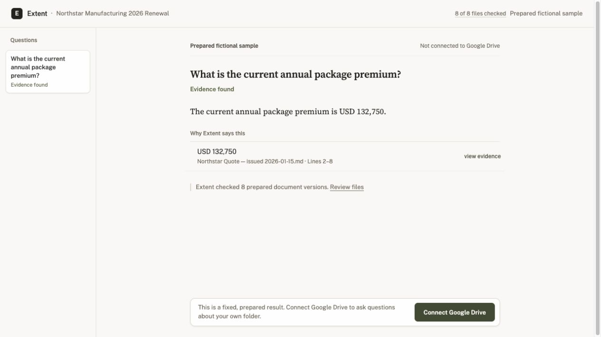

# Extent

Connect a Google Drive folder, ask questions across its documents, and inspect the exact quotes
behind each finding. Extent also shows when sources disagree or files could not be checked.



## What Extent does

- Connects to one Google Drive folder with read-only access
- Reads supported files in that folder and its visible subfolders
- Shows a small set of findings tied to exact quotes, files, pages, or lines
- Keeps different supported values visible when sources disagree
- States when unavailable files prevent a firm folder-wide answer
- Includes a prepared fictional sample that needs no sign-in or Drive access

Extent helps an analyst or operator find and compare relevant passages. It does not decide
which document has legal or business authority. A quote shows what a source says, not whether the
source is correct, current, complete, or controlling.

## Architecture

```text
Browser -> Next.js / React -> FastAPI -> Postgres
                                   |
                                   +-> Redis / RQ -> file-reading worker
                                   +-> Google Drive and model providers
```

`apps/web` owns the interface, routes, accessibility, and response checks. `apps/api` owns Google
Drive access, file reading, search, answer generation, evidence checks, and persistence. Pydantic
models generate the checked-in OpenAPI document and TypeScript client.

The answer provider returns a structured draft. FastAPI checks each quote, number, date, source,
location, and workspace boundary before it stores and returns a finding. If those checks fail,
Extent shows the relevant passages or states that it could not support a finding.

See [docs/architecture.md](docs/architecture.md) for the service boundaries and data flow.

## Run locally

### Requirements

- Node.js 20.9 or newer
- pnpm 10 or newer
- Python 3.12 or newer
- Docker with Compose for a connected Google Drive folder
- Tesseract for PDF OCR in the worker

### Install

Run these commands from the repository root:

```bash
pnpm install --frozen-lockfile
pnpm setup:api
cp .env.example .env
```

`pnpm setup:api` creates `.venv`, installs the pinned Python requirements, and installs the API
package in editable mode.

### Open the prepared sample

The prepared fictional sample does not require Docker, Postgres, Redis, Google credentials, or
model credentials.

Start the API and web app in separate terminals:

```bash
pnpm dev:api
```

```bash
pnpm dev:web
```

Open [http://localhost:3000/sample](http://localhost:3000/sample).

| Service           | Local URL                        |
| ----------------- | -------------------------------- |
| Web app           | `http://localhost:3000`          |
| FastAPI           | `http://127.0.0.1:8000`          |
| API documentation | `http://127.0.0.1:8000/api/docs` |
| Liveness          | `http://127.0.0.1:8000/healthz`  |

### Connect Google Drive locally

Install Tesseract on the worker host:

```bash
# macOS
brew install tesseract

# Debian or Ubuntu
sudo apt-get install tesseract-ocr
```

Start Postgres with pgvector and Redis, then apply the database migrations:

```bash
pnpm infra:up
pnpm migrate
```

Run the API, worker, and web app in separate terminals:

```bash
pnpm dev:api
```

```bash
pnpm dev:worker
```

```bash
pnpm dev:web
```

Create a Google OAuth web client and register this exact redirect URI:

```text
http://localhost:3000/api/backend/v1/auth/google/callback
```

If the OAuth consent screen is in testing, add each account you will use as a Google test user.

Set the following values in the ignored `.env` file:

| Variable                            | Purpose                                                      |
| ----------------------------------- | ------------------------------------------------------------ |
| `EXTENT_GOOGLE_CLIENT_ID`           | Google OAuth web-client ID                                   |
| `EXTENT_GOOGLE_CLIENT_SECRET`       | Server-only Google OAuth secret                              |
| `EXTENT_CREDENTIAL_ENCRYPTION_KEYS` | Versioned 32-byte AEAD keyring for stored Google credentials |
| `EXTENT_MODEL_API_KEY`              | Server-only answer-provider credential                       |
| `EXTENT_EMBEDDING_API_KEY`          | Optional local semantic-search credential                    |

The key generator and remaining local settings are documented in [`.env.example`](.env.example).
Keep access tokens, refresh tokens, and ID tokens out of environment files. Extent obtains them
through Google OAuth.

Restrict the local file, then open the connection page:

```bash
chmod 600 .env
```

[http://localhost:3000/connect](http://localhost:3000/connect)

`pnpm infra:down` stops Postgres and Redis without deleting data. `pnpm infra:reset` deletes the
local volumes and all local database and queue data.

## Verify

Run the full repository check:

```bash
pnpm check
```

This runs formatting, linting, strict Python and TypeScript type checks, focused unit tests,
migration and OpenAPI/client drift checks, and the production Next.js build.

Focused commands:

| Command              | What it checks                                       |
| -------------------- | ---------------------------------------------------- |
| `pnpm lint`          | Python and TypeScript lint rules                     |
| `pnpm typecheck`     | Strict mypy and TypeScript checks                    |
| `pnpm test`          | Focused API and browser-boundary unit tests          |
| `pnpm migrate:check` | The Alembic revision graph and single migration head |
| `pnpm openapi:check` | The OpenAPI document and generated TypeScript client |
| `pnpm build`         | The production Next.js build                         |

## Deployment

The production layout uses Vercel for Next.js and Render for FastAPI, the worker, Postgres with
pgvector, and Redis-compatible Key Value:

```text
Browser -> Vercel Next.js -> Render FastAPI -> Render Postgres/pgvector
                                      |      -> Render Key Value
                                      `-> RQ queue
Render worker -------------------------------^
```

This repository does not include `render.yaml` or `vercel.json`. Configure the services in the
Vercel and Render dashboards. No public deployment URL is claimed here until the release checks
below pass.

### Render API and worker

Provision Render Postgres and Key Value. Create a Python 3.12 web service and background worker
from the same repository. Install Tesseract and its English language data on the worker host.

Use this build command for both Python services:

```bash
python3 -m venv .venv && \
  .venv/bin/python -m pip install -r apps/api/requirements.lock && \
  .venv/bin/python -m pip install --no-build-isolation --no-deps -e apps/api
```

API start command:

```bash
.venv/bin/python -m uvicorn extent_api.main:app \
  --app-dir apps/api/src --host 0.0.0.0 --port "$PORT"
```

Worker start command:

```bash
.venv/bin/python -m extent_api.worker
```

Run migrations once for each release. API and worker startup do not change the schema.

```bash
.venv/bin/alembic -c apps/api/alembic.ini upgrade head
```

Set these environment values on the API and worker where applicable:

| Variable                           | Production value                                                           |
| ---------------------------------- | -------------------------------------------------------------------------- |
| `EXTENT_ENVIRONMENT`               | `production`                                                               |
| `EXTENT_DATABASE_URL`              | Render internal URL using `postgresql+psycopg://`                          |
| `EXTENT_DATABASE_MIGRATION_URL`    | Optional direct Postgres URL for Alembic                                   |
| `EXTENT_REDIS_URL`                 | Render Key Value internal URL                                              |
| `EXTENT_QUEUE_NAME`                | The same queue name on the API and worker                                  |
| `EXTENT_ALLOWED_HOSTS`             | Exact Render API hostname without a scheme or wildcard                     |
| `EXTENT_ALLOWED_ORIGINS`           | Exact Vercel HTTPS origin                                                  |
| `EXTENT_PUBLIC_WEB_ORIGIN`         | Exact Vercel HTTPS origin                                                  |
| Google OAuth settings              | Client ID, client secret, and the same encryption keyring on both services |
| Answer-provider settings           | API key, HTTPS base URL, model name, and timeout                           |
| Embedding settings                 | API key, HTTPS base URL, and a model configured for 1,536 dimensions       |
| `EXTENT_QUERY_REQUESTS_PER_MINUTE` | `12` unless intentionally changed                                          |
| `EXTENT_OCR_EXECUTABLE`            | Tesseract path or executable name on the worker                            |

Production startup rejects missing credentials, loopback database or Redis URLs, non-HTTPS web
origins, local host allowlists, and mismatched CORS settings.

### Vercel web app

Create a Vercel project with `apps/web` as the root directory. Use pnpm for installation and
`pnpm build` as the build command. Set only these server-side variables:

| Variable                  | Value                                   |
| ------------------------- | --------------------------------------- |
| `EXTENT_API_INTERNAL_URL` | Origin-only HTTPS URL of the Render API |
| `EXTENT_API_PROXY_TARGET` | The same Render API origin              |

Do not create `NEXT_PUBLIC_*` copies. Browser API and OAuth traffic use the same-origin
`/api/backend/*` rewrite.

Register the deployed Google OAuth callback after the Vercel domain is final:

```text
https://YOUR_VERCEL_DOMAIN/api/backend/v1/auth/google/callback
```

### Release checks

- `/`, `/sample`, and `/api/backend/v1/health` respond through the Vercel origin.
- The deployed `alembic_version` matches the repository migration head.
- Google sign-in returns to Vercel and sets the secure opaque session cookie.
- A test folder reaches a final file state through the worker.
- A supported finding opens the expected exact quote.
- A finding without exact support is not shown.
- Browser bundles and logs contain no Google, model, database, or Redis credentials.

See [docs/deployment.md](docs/deployment.md) for the full environment boundary and OAuth logging
rules.

## Supported files and limits

| Area                  | Current behavior                                                           |
| --------------------- | -------------------------------------------------------------------------- |
| Google Drive          | One folder, visible subfolders, and read-only access                       |
| File types            | PDF, Google Docs, DOCX, comma-separated UTF-8 CSV, TXT, and Markdown       |
| PDF text              | Embedded text first, then page-aware OCR when no usable text is found      |
| Folder depth          | Up to 5 nested levels                                                      |
| Stored passages       | Up to 1,500 across one folder-reading run                                  |
| DOCX                  | Body paragraphs and tables, with `document.xml` capped at 20,000,000 bytes |
| Complete-list results | Up to 200 distinct rows before a visible overflow failure                  |
| Questions             | 12 authenticated attempts per user per UTC minute by default               |
| Worker attempts       | Initial execution plus 2 retries                                           |

Unsupported, inaccessible, malformed, encrypted, or capped files remain visible. If some files
could not be checked, Extent keeps that limit with the result.

Extent does not currently claim Google restricted-scope verification, enterprise identity or
retention controls, managed key rotation, malware scanning, OCR isolation, load or SLO evidence,
or readiness for regulated customer documents.

## Security

- Google Drive access is read-only. Extent cannot edit or delete files in Drive.
- Browser sessions use an opaque `HttpOnly`, `SameSite=Lax` cookie. Session records are stored as
  hashes.
- OAuth state and PKCE records are one-use. Stored Google credentials use versioned authenticated
  encryption.
- Database reads are owner-scoped. Mutations require the expected origin.
- Callback queries are redacted. Application events exclude credentials, provider responses,
  document text, questions, request bodies, route parameters, and query strings.
- Production validates exact hosts and origins, caps mutation bodies at 16 KiB, and applies the
  per-user question limit before provider work.

Report a suspected vulnerability privately to the repository owner. Do not open a public issue
with credentials, source documents, or exploit details.

## Repository layout

```text
apps/web/                 Next.js and React interface
apps/api/                 FastAPI package, migrations, providers, and domain services
apps/api/openapi.json     Checked-in API contract
compose.yaml              Local Postgres with pgvector and Redis
docs/architecture.md      Runtime ownership and data flow
docs/deployment.md        Production environment and OAuth diagnostics
```

## License

No software license has been selected or included. Until the repository owner adds one, the code
is not licensed for reuse, modification, or redistribution.
